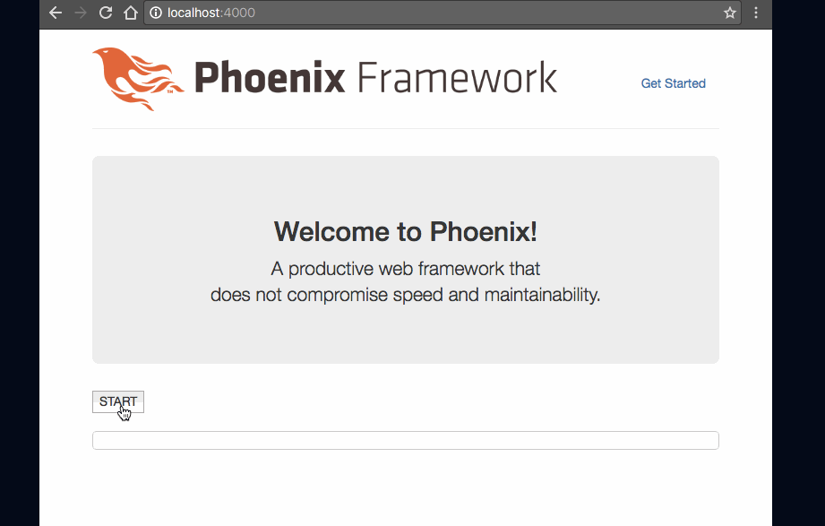

# Elixir/Phoenix chunked response example
The repository is HTTP chunked transfer encoding example for Elixir/Phoenix. a.k.a HTTP stream response or EventSource.




##How to Run
```
mix deps.get
npm install
./node_modules/brunch/bin/brunch b -p
mix phoenix.server
```

Open <http://localhost:4000>, and push `START` button. Then, `start.sh` results send to client with HTTP chunked response.


##How to send chunked response
###1. Dependent libraries
- mix.exs :

```elixir
def application do
  […,
   applications: […, :porcelain]]
end

defp deps do
  [
    …,
    {:porcelain, "~> 2.0"}
  ]
end
```

[Porcelain](https://hex.pm/packages/porcelain) library is for execute shell-script.


- package.json :

```
"dependencies": {
  …,
  "stream-http": "~2.4.0"
},
```

[stream-http](https://www.npmjs.com/package/stream-http) library is for client of chunked response.


###2. Server code
- web/controller/page_controller.ex

```elixir
def start(conn, _params) do
  # set-up chunked response
  conn = conn
  |> put_resp_content_type("text/event-stream")
  |> send_chunked(200)

  # send chunk data
  conn |> chunk("a")
  conn |> chunk("b")
  conn |> chunk("c")
end
```


###3. Client code
- web/static/js/app.js

```javascript
import "stream-http"
```

Add client library.

- web/templates/page/index.html

```javascript
var http = require('stream-http')
var req = http.request(options, (res) => {
  res.setEncoding('utf8');
  res.on('data', (chunk) => {
    // Received chunked-response.
    // Add output text.
    document.getElementById('chunked-output').textContent = document.getElementById('chunked-output').textContent + chunk;
  });
  res.on('end', () => {
    // Received all data.
  });
});

req.write(postData);
req.end();
```


##Note
If you use Nginx, you should add `proxy_buffering off;`. Nginx cache server response, cause client receive all response at on time.


##References
- [Protocols - Plug.Conn](https://hexdocs.pm/plug/Plug.Conn.html#module-protocols)

